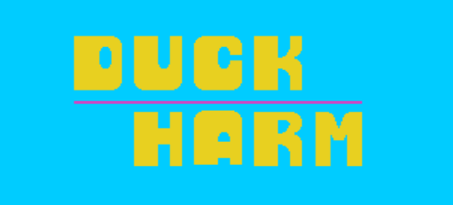

# 🦆🐶🙋🏼‍♂️ DuckHarm: exactly as you remember it, but more tiring

Play the popular shooting game, but with a twist: you need to use your arm to aim.
The game needs access to your webcam to see where your hand is.

The game is directly playable on this [P5js page](https://editor.p5js.org/Filippo_Z/sketches/Dlo34ln7Z)

## 🕹 Functionalities
- Train: carefully go through the initial calibration to teach the program how to follow your movements
- Aim: move your arm to try to shoot the duck
- Pain: feel the soreness, but rejoice at the rewarding moment of getting a point

## 🧠 Motivation
This was the final 2-days machine learning assignment for the Machine Learning @School Camp at SUPSI, 2019.

Read more about the activities on this article from [LaRegione](https://www.laregione.ch/rubriche/tecnologia/1377582/l-intelligenza-artificiale-nei-progetti-di-23-giovani-ticinesi) or on the [official event website](https://ml-school.netlify.app/)